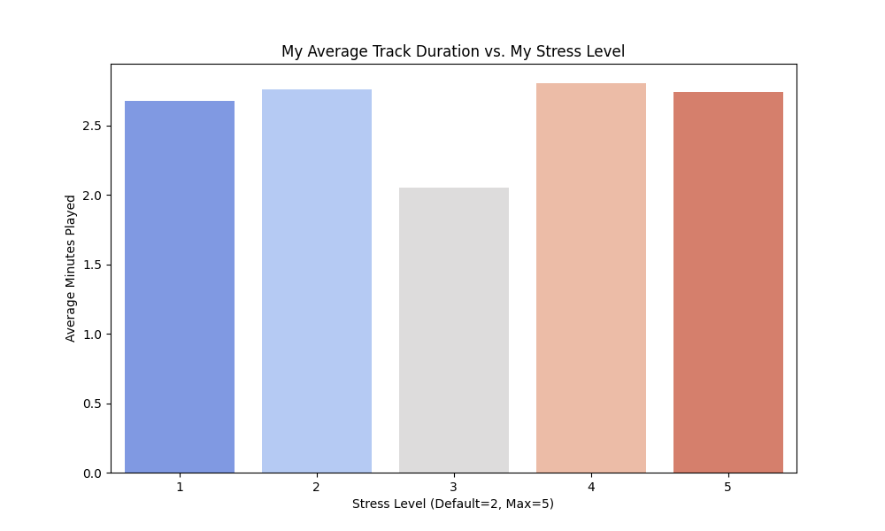

# DSA210-TermProject

# A Multivariate Analysis of My Music Consumption Patterns Based on My Menstrual Cycle, Academic Stress, and Emotional State

## PURPOSE:
I am investigating how my music consumption (via Spotify history) correlates with my academic stress, emotional state (crying logs), and biological cycles (menstrual data).

## Things I have done in Milestone 1:
- **Data Merging:** I have combined my Spotify JSON files (extended streaming history data) with custom CSV logs.
- **Handling Missing Data:** Non-identified days in the academic calendar are defaulted to a stress level of 2.
- **Integration:** I have utilized range-based matching for stress/period dates and specific date matching for crying incidents.
- **EDA:** I have visualized the relationship between my stress level and my average track duration.
- **Statistics:** I have performed a T-Test to see if my stress level significantly changes my listening behavior.

## How to Run:
1. Install dependencies: "pip install -r requirements.txt"
2. Ensure all data files ("Streaming_History_Audio_*.json", "academic_stress.csv", "menstrual_data.csv", "crying_logs.csv") are in the root folder.
3. Run the script: "python main.py"

## Deliverables:
- "main.py": The core analysis script
- "my_featurized_data.csv": The integrated dataset with all features
- "stress_listening_eda.png": Visualization showing my stress level vs. my listening trend

### Initial Findings (Milestone 1):
My initial exploratory analysis is focused on the relationship between **Academic Stress Levels** and **Average Track Duration**. 
- **p-Value:** 0.2663
- **Interpretation:** The current results do not show a statistically significant difference in listening duration based on my stress level.

**Why?**
This is likely because my average track duration alone may not reflect my emotional shifts. For the next step, I am going to integrate **Spotify Audio Features (Energy, Valence)** to see if the *type* of music changes, even if the *duration* remains the same.

## MILESTONE 2:
I have applied second EDA and hypothesis test to figure out the relationship between my stress level and the number of tracks, by utilizing Pearson correlation.
Therefore, we hav had a visualization showing my stress level vs. my number of tracks.
We have obtained the **p-Value** as **0.1208** (>0.05). So, the correlation between my stress level and the number of tracks is not significant.
**Why?**
This is likely because there might be a relationship between my mood and the qualitative features of the songs (like Energy and Valence) but not the quantitative ones.
Hence, I will try to investigate that kind of relation.

